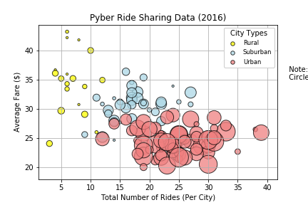
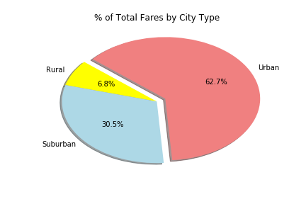
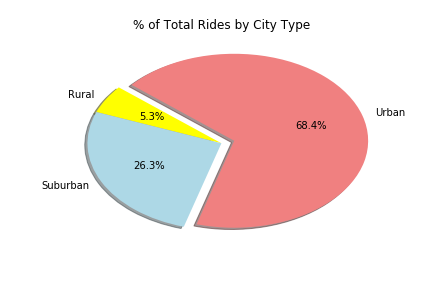
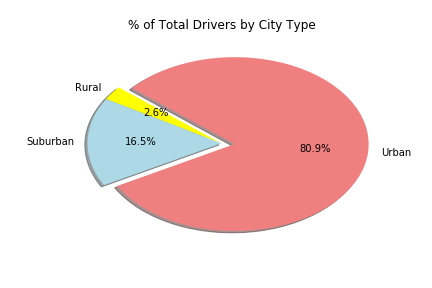

# MATPLOTLIB_Analyzing-Data-Using-Visualizations

### The objective is to build a Bubble Plot that showcases the relationships between certain variables and create certain pie charts using ride share data. The goal is to offer data-backed guidance on new opportunities for market differentiation. Raw data give (found in the data folder) includes information about every active driver and historic ride, including details like city, driver count, individual fares, and city type. The analysis can be found as the file named "Pyber_ASpirou."

## Description of Three Observable Trends:

### Overall, there seems to be a negative relationship between the average fare of a ride and the total number of rides per city, with Rural areas having the highest rates of fares, charging $34.64 per ride on average, while Suburban & Urban areas charge $30.74 and $24.00 on average. But even though the rates are higher in Rural areas, it's the Urban areas in which show the highest percentage of total rides given (68.4%) and number of drivers available (80.9%). Suburban areas come in second with percentage of total rides being 26.3% and number of drivers being 16.5%, while Rural areas come in last, with total rides encompassing only 5.3% and number of drivers only being 2.6%. These trends can be explained by a higher rate of the population in Urban areas not having access to personal transportation. Also, higher rates in Rural areas may be due to larger distances driven due to Rural areas being more sparse. 

Please see below for corresponding figures to data:

